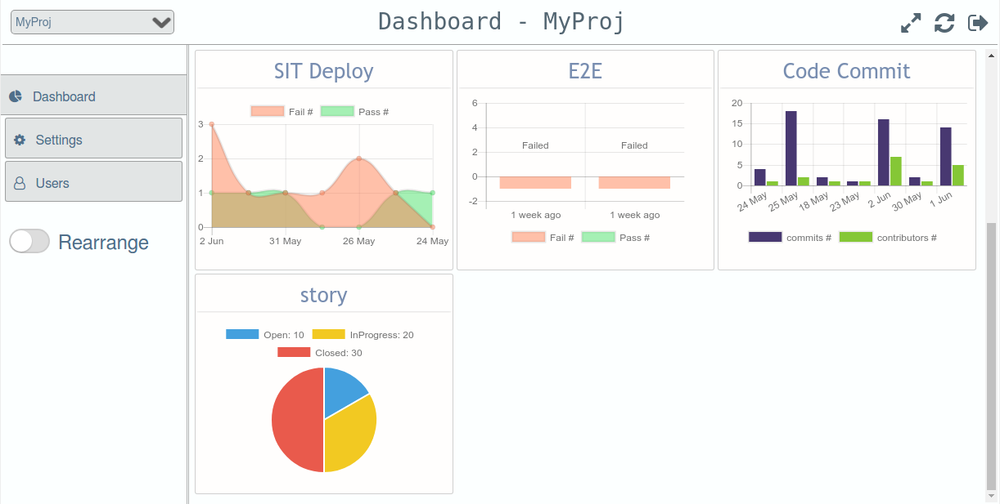
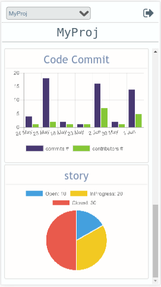

   <a name="README">[](http://test)</a>
<hr>


SimpleDash is a agile dashbard which tracks activities from various sources. The widgets makes it more customizable.

## Getting Started

These instructions will get you a copy of the project up and running.

### Prerequisites

What things you need to install the dashboard and how to install them

```
NodeJS
```

### Installing

A step by step series of examples that tell you have to get the dashboard up and running

Downalod or clone the simpleDash to your local

```
git clone https://github.com/thilrajr/simpledash.git
```

Install the npm dependencies

```
npm install
```

Run the server and collector in seperate terminal

```
node server
```

```
node collector
```
You can see the home page in localhost:8091

## Screenshots

### Desktop view


### Mobile view


## Contributing

You are welcome to contribute but the test coverage is less as of now. Make sure that you are following the standards, quality & maintainable and don't forget to add tests if it required. It will make the review process easier. The services are tested using Jasmine-node.

### Running tests

Run the below command for linting and testing

```
npm test
```

## Built With

* [Express](https://expressjs.com/) - Web Application Framework
* [lowdb](https://github.com/typicode/lowdb) - For database
* [Handlebars](http://handlebarsjs.com/) - For creating widgets
* [ChartJS](http://www.chartjs.org/) - For charts
* [Fontawsome](http://fontawesome.io/) - For icons
* [JQuery](https://jquery.com/) - For few ui functions

## Authors

* **Raj** - *Initial work* - [profile](https://github.com/thilrajr)

See also the list of [contributors](https://github.com/thilrajr/simpledash/contributors) who participated in this project.

## License

This project is licensed under the Apache 2.0 License - see the [LICENSE.md](LICENSE.md) file for details

